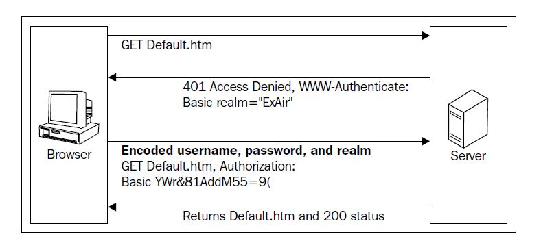

Whenever our Web browser tries communicating with a Web server, it is done by using the **Hypertext Transfer Protocol (HTTP)** which functions as a request-response protocol.     

# Reveal structure of request

## Method

+ **GET**

Fetch information from the given server using the given URI.

+ **HEAD**

Similar to GET but the difference is, it delivers only the status line and header section

+ **POST**

Submit data to the server that we wish to process.

+ **PUT**

Create or overwrite all the current representations of the target resource, when we intend to create a new URL

+ **DELETE**

Remove all the resources that described by the given *Request-URI*.     

+ **OPTIONS**

Specify the communication options for a request/response cycle. It lets the client to mention different options associated with the resource.

## Request URI

Uniform Resource Identifier (URI) has the ability to recognize the name of the resource.

## headers

A dictionary of headers to be sent in the request. They are colon-separated key value pairs. Some of the *request-headers* values are:

+ **Accept-Charset**

This is used to indicate the character sets that are acceptable for the response.

+ **Authorization**

This contains the value of the credentials which has the authentication information of the user agent.

+ **Host**

This identifies the Internet host and port number of the resource that has been requested, using the original URI given by the user.     

+ **User-agent**

It accommodates information about the user agent that originates the request. This can be used for statistical purposes such as tracing the protocol violations.     

## files

This can be used while dealing with multipart upload. It's the dictionary of files, with key as file name and value as file object.     

## data

This is the body to be attached to the `request.json`. There are two cases that come in to the picture here:

+ If *json* is provided, *content-type* in the header is changed to *application/json* and at this point, *json* acts as a body to the request.
+ If both *json* and *data* are provided together, *data* is silently ignored.     

## params

A dictionary of URL parameters to append to the URL

## auth

This is used when we need to specify the authentication to the request. It's a tuple containing username and password.     

## cookies

A dictionary or a cookie jar of cookie which can be added to the reques.

## hooks

A dictionary of callback hooks.

# Essence of Requests

As with *HTTP/1.0*, *HTTP/1.1* has a lot of perks and added features like reusing a connection multiple times which decreases the considerable overhead, keep-alive mechanism, and so on. And fortunately, *requests* is built from it, giving us the benefits of interacting with the web smoothly and seamlessly. There is no need to manually add query strings to our URIs, or to encode our POST data. Keep-alive and HTTP connection pooling are 100 percent automatic, powered by *urllib3*, which is embedded within *requests*. With *requests* we are gifted with a means of forget about encoding parameters again and again, irrespective of whether it is GET/POST.     

There is no requirement for manually adding query strings to the URLs, and also to the features such as connection pooling keep-alive, sessions with cookie persistence, Basic/Digest Authentication, Browser-style SSL Verification, Connection Timeouts, Multipart File Uploads, and so on.

# Response content

Response content is the information about the server's response that is delivered back to our console when we send a request.      

While interacting with the web, it's necessary to decode the response of the server. While working on an application, there are many cases in which we may have to deal with the raw, or JSON, or even binary response. For this, *requests* has the capability to automatically decode the content from the server. Requests can smoothly decode many of the Unicode charsets. To add to that, Requests makes informed guesses about the encoding of the response. This basically happens taking the headers into consideration.        

If we access the value of `r.content`, it results us the response content in a raw string format. And if we access `r.text`, the Requests library encodes the response (`r.content` value) using `r.encoding` and returns a new encoding string. In case, if the value of `r.encoding` is `None`, Requests assumes the encoding type using `r.apparent_encoding`, which is provided by the `chardet` library.       

# Accessing cookies with Requests

# `timeout` keep productive

When we use the `timeout` parameter, we are telling Requests not to wait for a response after some specific time period. If we use `timeout`, it's not equivalent to defining a time limit on the whole response download. It's a good practice to raise an exception if no bytes have been acknowledged on the underlying socket for the stated `timeout` in seconds.     

# Using Session objects persisting parameters

The *Requests* module contains a *session* object, which has the capability to persist settings across the requests. Using this *session* object, we can persist cookies, we can create prepared requests, we can use the keep-alive feature and do many more things. The Session object contains all the methods of Requests API such *GET*, *POST*, *PUT*, *DELETE* and so on.      

# Verifying an SSL certificate

Requests provides the facility to verify an SSL certificate for HTTPS requests. We can use the **verify** argument to check whether the host's SSL certificate is verified or not.

# Body Content Workflow

Take an instance where a continuous stream of data is being downloaded when we make a request. In this situation, the client has to listen to the server continuously until it receives the complete data. The parameter **stream** comes into play.       

 If we make a request with the parameter `stream=True`, the connection remains open and only the headers of the response will be downloaded. This gives us the capability to fetch the content whenever we need by specifying the conditions like the number of bytes of data.      

## `iter_content()`

By setting the parameter `stream=True` and by accessing the response as a file-like object that is `response.raw`, if we use the method `iter_content`, we can iterate over `response.data`. This will avoid reading of larger response at once.        

```python
iter_content(chunk_size=size in bytes, decode_unicode=False)
```

In the same way, we can iterate through the content using `iter_lines` method which will iterate over the response data one line at a time.     

## `iter_lines()`

```python
iter_lines(chunk_size = size in bytes, decode_unicode=None, delimitter=None)
```

# The keep-alive facility

As the *urllib3* supports the reuse of the same socket connection for multiple requests, we can send many requests with one socket and receive the responses using the keep-alive feature in the *Requests* library.       

Within a session, it turns to be automatic. Every request made within a session automatically uses the appropriate connection by default. The connection that is being used will be released after all the data from the body is read.           

# Streaming uploads

A file-like object which is of massive size can be streamed and uploaded using the *Requests* library. All we need to do is to supply the contents of the stream as a value to the *data* attribute in the *request* call.     

```python
with open('massive-body', 'rb') as file:
    requests.post('http://example.com/some/stream/url', data=file)
```

# Using generator sending chunk encoded Requests

Chunked transfer encoding is a mechanism for transferring data in an HTTP request. With this mechanism, the data is sent in a series of chunks. Requests supports chunked transfer encoding, for both outgoing and incoming requests. In order to send a chunk encoded request, we need to supply a generator for your body.             

```python
def generator():
    yield "Hello "
    yield "World!"
    
requests.post('http://example.com/some/chunked/url/path', data=generator())
```

# Iterate over streaming APIs

Streaming API tends to keep the request open allowing us to collect the stream data in real time. While dealing with a continuous stream of data, to ensure that none of the messages being missed from it we can take the help of `iter_lines()` in Requests. The `inter_lines()` iterate over the response data line by line. This can be achieved by setting the parameter stream as *True*  while sending the request.        

```python
import requests
import json

r = requests.get('http://httpbin.org/stream/4', stream=True)
for line in r.iter_lines():
    if line:
        print(json.loads(line))
```

# Self-describing the APIs with link headers

Take a case of accessing a resource in which the information is accommodated in different pages. If we need to approach the next page of the resource, we can make use of the link headers. The link headers contain the meta data of the requested resource, that is the next page information in our case.          

```python
import requests

url = "https://api.github.com/search/code?q=addClass+user:mozilla&page=1&per_page=4"

r = requests.head(url=url)
print(r.headers['link'])
```

# Transport Adapter

It is used to provide an interface for Requests sessions to connect with HTTP and HTTPS. This will help us to mimic the web service to fit our needs. With the help of Transport Adapters, we can configure the request according to the HTTP service we opt to use. Requests contains a Transport Adapter called **HTTPAdapter** included in it.       

# Authenticating with Requests

Requests supports diverse kinds of authentication procedures, and it is built in such a way that the method of authentication feels like a cakewalk.    

## Basic authentication

Basic authentication is a popular, industry-standard scheme of authentication, which is specified in HTTP 1.0. This method makes use of a *user-ID* and *password* submitted by the user to get authenticated. The submitted *user-ID* and *password* are encoding using *Base64* encoding standards and transmitted across HTTP. The server gives access to the user only if the *user-ID* and the *password* are valid.        

### Advantages

+ The main advantage of using this scheme is that it is supported by most of the web browsers and servers. Even though it is simple and straightforward, it does have some disadvantages. Though all the credentials are encoded and transferred in the requests, they are not encrypted which makes the process insecure. One way to overcome this problem is by using SSL support while initiating a secure session.      
+ The credentials persist on the server until the end of the browser session, which may lead to the seizure of resources. And also, this authentication process is wide open to **Cross Site Request Forgery (CSRF)** attacks, as the browser automatically sends the credentials of the user in the subsequent requests.      

### follow steps

1. If a requested resource needs authentication, the server returns *http 401* response containing a *WWW-Authenticate* header

2. If the user sends another request with the user ID and password in the *Authorization* header, the server processes the submitted credentials and gives the access.'

   

```python
import requests
from requests.auth import HTTPBasicAuth


url = "https://api.github.com/user"

r = requests.get(url=url, auth=HTTPBasicAuth('Qlhouse', 'cf8bdbde5b6bcef7ec2e8a9d1d6e8e9e876659ac'))
with open('temp.html', 'wb') as fh:
    fh.write(r.content)
print(r.status_code)
```

*`cf8bdbde5b6bcef7ec2e8a9d1d6e8e9e876659ac`* is access token. Creating a personal access token refers to "https://docs.github.com/articles/creating-a-personal-access-token-for-the-command-line".

## Digest authentication

Digest authentication is one of the well known HTTP authentication schemes. This type of authentication makes use of *user-ID* and *password* just like Basic authentication, but the major difference comes in picture, when the credentials get transferred to the server.     

Digest authentication increases the security of credentials by going an extra mile with the concept of cryptographic encryption. When the user submits the password for the sake of authentication, the browser will apply an MD5 hashing scheme on it. The crux of the process lies in using nonce values (pseudo-random number) while encrypting the password which decrease the replay attacks.        


This type of authentication gains more strength, as the password in this encryption is not used in the form of plain text. The cracking of the password hashes becomes difficult in digest authentication with the use of a nonce, which counters the chosen plain text attacks.       

Even though Digest authentication overcomes most of the drawbacks of Basic authentication, it does have some disadvantages. This scheme of authentication is vulnerable to main-in-the-middle attacks. It reduces the flexibility of storing the password in the password's database, as well the well designed password databases use other encryption methods to store them.         

## Kerberos authentication

Kerberos is a type of Network authentication protocol, which uses a secret key cryptography to communicate between the client and server. It was developed at MIT to mitigate many security problem like replay attacks and spying. It makes use of *tickets* to provide authentication for the server-side resources. It followed the idea of avoiding additional logins (single)         

## OAuth authentication

OAuth is an open standard authorization protocol, which allows client applications a *secure delegated access* to the user accounts on third party services such as Google, Twitter, Github and so on.

### OAuth 1.0

OAuth authentication protocol came up with an idea of mitigating the usage of passwords, replacing them with secure handshakes with API calls between the applications. This was developed by a small group of web developers who are inspired by OpenID.      

Key terms used in the process of OAuth authentication:

+ **Consumer**: The HTTP Client who can make authenticated requests
+ **Service Provider**: The HTTP Server, which deals with the requests of OAuth
+ **User**: A person who has the control over the protected resources on the HTTP Server
+ **Consumer Key and Secret**: Identifiers which have the capability to authenticate and authorize a request
+ **Request Token and Secret**: Credentials used to gain authorization from the user
+ **Access Token and Secret**: Credentials to get access to the protected resources of the user


Initially, the client application asks the service provider to grant a request token. A user can be identified as an approved user by taking the credibility of the request token. It also helps in acquiring the access token with which the client application can access the service provider's resources.       

In the second step, the service provider receives the request and issues request token, which will be sent back to the client application. Later, the user gets redirected to the service provider's authorization page along with the request token received before as an argument.       

In the next step, the user grants permission to use the consumer application. Now, the service provider returns the user back to the client application, where the application accepts an authorized request token and gives back an access token. Using the access token, the user will gain an access to the application.         

### OAuth2.0

# Mock HTTP Requests Using HTTPretty


HTTPretty is an HTTP client mock library for Python. It re-implements the HTTP protocol by mimicking requests and responses.        

Essentially, HTTPretty works on socket level, which gives it the inward virtue of working with most of the HTTP client libraries and it is more specifically battle tested against HTTP client libraries like *Requests*, *urllib*. So, we can mock the interactions from our Request library without any difficulty.        

The cases in which HTTPretty comes to the rescue:

+ The condition in which the API server is down
+ The condition in which the API content has changed

## Installing HTTPretty

`pip install HTTPretty sure mock`

+ **mock**: It is a testing library which allows us to replace parts of the system test with mock objects         
+ **sure**: It is a Python library which is used to make assertions      

## Working with HTTPretty

There are three main steps to be followed while dealing with HTTPretty:

1. Enable HTTPretty
2. Register the uniform resource locator to HTTPretty
3. Disable HTTPretty

We should enable HTTPretty initially, so that it will apply monkey patching; that is, a dynamic replacement of the attributes of the socket module. We will be using the function `register_uri` for registering the uniform resource locator.        

> **method: register_uri(class, uri, body)**

And at the end of our testing process, we should disable HTTPretty so that it doesn't alter the behavior of the other.          

```python
import requests
import httpretty
from sure import expect

def example():
    httpretty.enable()
    httpretty.register_uri(httpretty.GET, "http://google.com/",
                           body="This is the mocked body",
                           status=201)
    response = requests.get("http://google.com/")
    expect(response.status_code).to.equal(201)
    httpretty.disable()
```

We can simplify the preceding code using a decorator. As in the first and third step, that is, enabling and disabling HTTPretty are same all the time, we can use a decorator so that those functions get wrapped up whether we want them to come into the picture. The decorator looks like this: `@httpretty.activate`. 

```python
import requests
import httpretty
from sure import expect

@httpretty.activate
def example():
    httpretty.register_uri(httpretty.GET, "http://google.com/",
                           body="This is the mocked body",
                           status=201)
    response = requests.get("http://google.com/")
    expect(response.status_code).to.equal(201)
```

## Setting headers

HTTP header fields supply the necessary information about the request or response. We can mock any HTTP response header by using HTTPretty. To achieve that, we will be adding them as keyword arguments. We should keep in mind that the keys of the keyword arguments are always lower case and have underscores (_) instead of dashes.        

```python
import requests
import httpretty
from sure import expect

@httpretty.activate
def example():
    httpretty.register_uri(httpretty.GET, "http://api.example.com/some/path",
                           body='{"success": true}',
                           status=200,
                           content_type='text/json')

    response = requests.get("http://api.example.com/some/path")

    expect(response.json()).to.equal({'success': True})
    expect(response.status_code).to.equal(200)
```

## Working with responses

When we mock HTTP requests using HTTPretty, it returns an `httpretty.Response` object. We can generate the following responses through callbacks:

+ Rotating Responses
+ Streaming Responses
+ Dynamic Responses

### Rotating responses

Rotating responses are the responses we receive in a given order when we send a request to a server with the same URL and same request method. We can define as many responses as we wish with the responses argument.        

# Interact with Social Media

## API introduction

A web API is a set of rules and specifications. It assists us to communicate with different software. There are different types of APIs, and REST API is the subject matter here. **REpresentational State Transfer (REST)** is an architecture containing guidelines for building scalable web services. An API which adheres to the guidelines and conforms to the constraints of REST is called a **RESTful API**. In a nutshell, the constraints are:

+ Client-server
+ Stateless
+ Cacheable
+ Layered system
+ Uniform interface
+ Code on demand

Google Maps API, Twitter API, and GitHub API are various examples RESTful APIs.

## Interact with Twitter

To get started with Twitter API we should first obtain an API key. It is a code which is passed by the computer programs while calling an API. The basic purpose of the API key is that is uniquely identifies the program that it is trying to interact with. It also serves us in the process of authentication with its token.        

The next step involves the process of creating an authentication request which will give us access to the Twitter account. Once we have authenticated successfully, we will be free to deal with tweets, followers, trends, searches, and stuff.       

### Obtain an API Key

1. Sign into the page <https://developer.twitter.com/en/apps> with your Twitter credentials.         
2. Click on **Create New App** button.        
3. Fill the following fields to set up a new application:
   + **Name**: Specify your application name. This is used to attribute the source of a tweet and in user-facing authorization screens.    
   + **Description**: Enter a short description of your application. This will be shown when a user faces the authorization screens.       
   + **Website**: Specify you fully qualified website URL. A fully qualified URL includes *http://* or *https://* and will not have a trailing slash in the end (for example: *http://example.com* or https://www.example.com).       
   + **Callback URL**: This field answers the question----where should we return after successfully authenticating.      
   + **Developer Agreement**: Read the **Developer Agreement** carefully and then check the checkbox **Yes, I agree**.       
4. Now, by clicking on **Create your Twitter application**, a new application will be created for us with the previously specified details.         
5. After the successful creation, we'll be redirected to a page where the **Details** tab is selected by default. Now, select the **Keys and Access Tokens** tab. We should click on **Create my access token** button to generate our access token.        
6. Lastly, make a note of the **Consumer Key (API Key), Consumer Secret (API Secret), Access Token** and **Access Token Secret**.           

